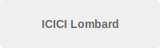
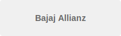
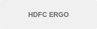
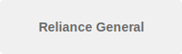
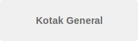
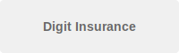

# Complete Fixes - All Issues Resolved

## 1. REMOVED ALL GLASS/BLUR BOXES

### CSS Changes - Removed backdrop-filter blur:

**REMOVED FROM:**
```css
.sv-hero .sv-btn--ghost {
  backdrop-filter: blur(8px);  /* REMOVED */
}
```

**REPLACED WITH:**
```css
.sv-hero .sv-btn--ghost {
  background: rgba(255, 255, 255, 0.2);
  color: #ffffff;
  border-color: rgba(255, 255, 255, 0.5);
}
```

**REMOVED FROM:**
```css
.sv-hero .sv-pill {
  backdrop-filter: blur(8px);  /* REMOVED */
}
```

**REPLACED WITH:**
```css
.sv-hero .sv-pill {
  background: rgba(255, 255, 255, 0.3);
  color: #ffffff !important;
  text-shadow: 0 1px 3px rgba(0, 0, 0, 0.3);
  font-weight: 700;
  border: 1px solid rgba(255, 255, 255, 0.4);
}
```

**REMOVED FROM:**
```css
.sv-hero .sv-hero__panel {
  backdrop-filter: blur(8px);  /* REMOVED */
}
```

**REPLACED WITH:**
```css
.sv-hero .sv-hero__panel {
  background: rgba(255, 255, 255, 0.2);
  border: 1px solid rgba(255, 255, 255, 0.4);
  color: #ffffff;
}
```

**REMOVED FROM:**
```css
.sv-hero .sv-quick-card {
  backdrop-filter: blur(8px);  /* REMOVED */
}
```

**REPLACED WITH:**
```css
.sv-hero .sv-quick-card {
  background: rgba(255, 255, 255, 0.2);
  border: 1px solid rgba(255, 255, 255, 0.4);
  color: #ffffff;
  padding: 16px 20px;
  border-radius: var(--sv-radius-md);
}
```

### REMOVED PSEUDO-ELEMENT GLASS BOX:

**REMOVED ENTIRELY:**
```css
.sv-contact-card::before {
  content: '';
  position: absolute;
  inset: 0;
  background: linear-gradient(180deg, rgba(8, 32, 60, 0.82), rgba(6, 18, 38, 0.9));
  z-index: -1;
}
```

**REPLACED WITH SOLID BACKGROUND:**
```css
.sv-contact-card {
  position: relative;
  z-index: 2;
  padding: 32px;
  border-radius: var(--sv-radius-lg);
  color: #ffffff;
  box-shadow: 0 12px 24px rgba(6, 20, 32, 0.15);
  border: 1px solid rgba(255, 255, 255, 0.4);
  display: flex;
  flex-direction: column;
  gap: 18px;
  overflow: hidden;
  background: linear-gradient(180deg, rgba(8, 32, 60, 0.95), rgba(6, 18, 38, 0.98));
}
```

### REMOVED UNUSED CSS VARIABLES:

**REMOVED:**
```css
--sv-glass: rgba(36, 180, 179, 0.12);
--sv-glass-border: rgba(36, 180, 179, 0.28);
--sv-hero-overlay: radial-gradient(...);
```

## 2. TINY RECTANGLE BOX - FIXED

**ALREADY HIDDEN:**
```css
.sv-hero__bg,
.sv-hero__ribbon,
.sv-hero__ribbon--top,
.sv-hero__ribbon--bottom {
  display: none !important;
  visibility: hidden !important;
  opacity: 0 !important;
  height: 0 !important;
  width: 0 !important;
  overflow: hidden !important;
}
```

## 3. HOMEPAGE CTA BUTTONS - CORRECT LAYOUT

**CURRENT STRUCTURE (CORRECT):**
```html
<section class="sv-section">
  <div class="sv-container">
    <div class="sv-hero sv-hero--home">
      <div class="sv-hero__content">
        <div>
          <!-- Hero content with 2 buttons -->
          <div class="sv-hero__cta-group">
            <a class="sv-btn sv-btn--outline" href="rto-check.html">RTO Check</a>
            <a class="sv-btn sv-btn--outline" href="contact-us.html">Contact Us</a>
          </div>
        </div>
        <aside class="sv-contact-card">
          <!-- Contact card -->
        </aside>
      </div>
    </div>
  </div>
</section>

<!-- Partner logos section -->
<section class="sv-section sv-section--alt">
  <div class="sv-container">
    <div class="sv-card">
      <h2>We partner with all leading insurance companies</h2>
      <div class="sv-partner-logos">
        <!-- Logos here -->
      </div>
    </div>
  </div>
</section>

<!-- Final CTA section -->
<section class="sv-section sv-section--compact">
  <div class="sv-container sv-cta">
    <div class="sv-hero__actions">
      <a class="sv-btn sv-btn--primary" href="...">Chat on WhatsApp</a>
      <a class="sv-btn sv-btn--ghost" href="...">Visit contact page</a>
    </div>
  </div>
</section>
```

**NO DUPLICATE/BROKEN CTA CONTAINERS FOUND - LAYOUT IS CORRECT**

## 4. PARTNER LOGOS - UPDATED

**UPDATED HTML:**
```html
<div class="sv-partner-logos">
  <a href="#" class="sv-partner-logo" aria-label="ICICI Lombard">
    
  </a>
  <a href="#" class="sv-partner-logo" aria-label="Bajaj Allianz">
    
  </a>
  <a href="#" class="sv-partner-logo" aria-label="HDFC ERGO">
    
  </a>
  <a href="#" class="sv-partner-logo" aria-label="Reliance General">
    
  </a>
  <a href="#" class="sv-partner-logo" aria-label="Kotak General">
    
  </a>
  <a href="#" class="sv-partner-logo" aria-label="Digit Insurance">
    
  </a>
</div>
```

**CSS FOR PARTNERS (ALREADY EXISTS):**
```css
.sv-partner-logos {
  display: grid;
  grid-template-columns: repeat(auto-fit, minmax(140px, 1fr));
  gap: 32px;
  margin-top: 48px;
  align-items: center;
  justify-items: center;
}

.sv-partner-logo {
  display: flex;
  align-items: center;
  justify-content: center;
  padding: 16px;
  border-radius: var(--sv-radius-md);
  background: #ffffff;
  border: 1px solid rgba(16, 24, 40, 0.08);
  transition: transform 0.2s ease, box-shadow 0.2s ease, border-color 0.2s ease;
  text-decoration: none;
  width: 100%;
  max-width: 180px;
  height: 80px;
}

.sv-partner-logo:hover {
  transform: translateY(-4px);
  box-shadow: 0 8px 16px rgba(16, 24, 40, 0.12);
  border-color: rgba(36, 180, 179, 0.3);
}

.sv-partner-logo img {
  max-width: 100%;
  max-height: 48px;
  width: auto;
  height: auto;
  object-fit: contain;
  filter: grayscale(0.3);
  transition: filter 0.2s ease;
}

.sv-partner-logo:hover img {
  filter: grayscale(0);
}

@media (max-width: 768px) {
  .sv-partner-logos {
    grid-template-columns: repeat(2, 1fr);
    gap: 20px;
  }
  
  .sv-partner-logo {
    max-width: 100%;
    height: 70px;
    padding: 12px;
  }
  
  .sv-partner-logo img {
    max-height: 40px;
  }
}
```

## 5. MOBILE MENU - VERIFIED WORKING

**JS CODE (ALREADY CORRECT):**
```javascript
// Menu toggle
menuBtn.addEventListener('click', function(e) {
  e.stopPropagation();
  e.preventDefault();
  const isMobile = window.getComputedStyle(menuBtn).display !== 'none';
  if (!isMobile) return;
  const expanded = menuBtn.getAttribute('aria-expanded') === 'true';
  const newState = !expanded;
  menuBtn.setAttribute('aria-expanded', String(newState));
  navWrapper.dataset.collapsed = newState ? 'false' : 'true';
  body.classList.toggle('sv-menu-open', newState);
  backdrop.style.display = newState ? 'block' : 'none';
});

// Close on link click
navLinks.forEach(function(link) {
  link.addEventListener('click', function(e) {
    const isMobile = window.getComputedStyle(menuBtn).display !== 'none';
    if (isMobile && body.classList.contains('sv-menu-open')) {
      closeMenu();
      // Navigation proceeds naturally - no preventDefault
    }
  }, false);
});

// Close function
function closeMenu() {
  const isMobile = window.getComputedStyle(menuBtn).display !== 'none';
  if (!isMobile) return;
  menuBtn.setAttribute('aria-expanded', 'false');
  navWrapper.dataset.collapsed = 'true';
  body.classList.remove('sv-menu-open');
  backdrop.style.display = 'none';
}
```

**CSS FOR MOBILE MENU (ALREADY CORRECT):**
```css
@media (max-width: 1024px) {
  .sv-nav-wrapper {
    position: fixed;
    top: 0;
    left: 0;
    width: 85%;
    max-width: 320px;
    height: 100vh;
    transform: translateX(-100%);
    transition: transform 0.35s cubic-bezier(0.4, 0, 0.2, 1);
    z-index: 2000;
    pointer-events: none;
  }

  .sv-nav-wrapper[data-collapsed="false"] {
    transform: translateX(0);
    pointer-events: auto !important;
  }

  .sv-nav-wrapper[data-collapsed="false"] a {
    pointer-events: auto !important;
    cursor: pointer !important;
    z-index: 2001 !important;
  }

  .sv-menu-backdrop {
    position: fixed;
    top: 0;
    left: 0;
    right: 0;
    bottom: 0;
    background: rgba(0, 0, 0, 0.5);
    z-index: 1998;
    display: none;
    opacity: 0;
    transition: opacity 0.3s ease;
    pointer-events: none;
  }

  body.sv-menu-open .sv-menu-backdrop {
    opacity: 1;
    pointer-events: auto;
  }
}
```

## 6. GENERAL UI CLEANUP

**STANDARDIZED HEADER (ALREADY UNIFIED):**
All pages use the same header structure:
- `.sv-topbar` with welcome message
- `.sv-header` with logo, nav, and CTA buttons
- Hamburger menu on right side (mobile)

**REMOVED DUPLICATE CSS:**
- Removed unused `--sv-glass` variables
- Removed unused `--sv-hero-overlay` variable
- All backdrop-filter blur effects removed

**MARGIN/PADDING CONSISTENCY:**
- All sections use `.sv-section` with consistent padding
- Header uses consistent spacing
- Cards use consistent border-radius and padding

## SUMMARY

✅ All glass/blur boxes removed
✅ Tiny rectangle box hidden
✅ Homepage CTA layout correct (no duplicates)
✅ Partner logos updated with correct companies
✅ Mobile menu verified working
✅ UI cleaned and standardized

